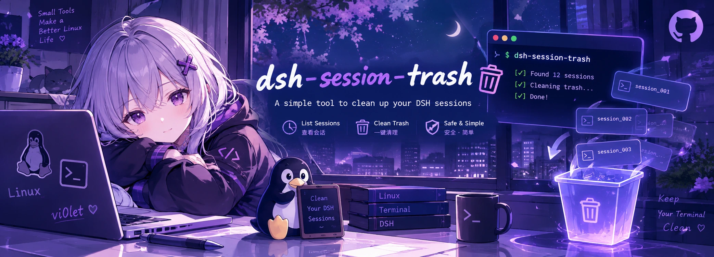
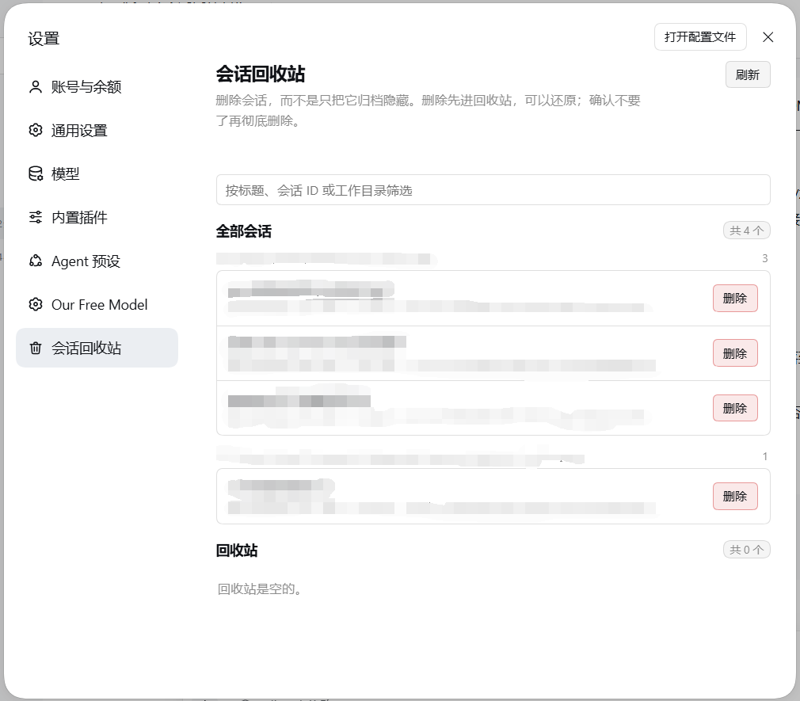

<p align="center">
  
</p>

# dsh-session-trash

给 DeepSeek Harness（`dsh`）补上**真正删除会话**的能力。

Harness 官方的「归档」只把会话移出侧栏，磁盘上的日志会一直堆着；桌面端更是没有任何删除入口
（内核协议里其实有 `session/delete`，但 Web/桌面 UI 没有暴露）。这个插件在**设置**里加一个
「会话回收站」分区，把删除做成一件可以后悔的事：

| 操作 | 做了什么 |
| --- | --- |
| **删除** | 先走官方归档通道把会话移出侧栏，再把日志目录 + 投影缓存一起移进 `$DSH_HOME/session-trash/`（**可还原**） |
| **还原** | 文件归位到原工作区分组，自动解除归档，会话立刻回到侧栏 |
| **彻底删除** | 真的删掉回收站里的日志目录，并把工作区记账、归档标记、宿主会话表里的活会话一起清干净，不可恢复 |
| **清空回收站** | 一次性彻底删除回收站里的全部条目 |

按日期和大小排序浏览全部会话，支持按标题 / 会话 ID / 工作目录筛选，并显示每个会话占多少磁盘。

## 环境要求

- DeepSeek Harness **0.2.0-rc.2** 桌面端或 `dsh web`（开发与验证都在这一版；用到的插槽与服务面见
  下文「实现」）。
- Node.js `^22.19.0 || >=24.0.0`（随 DSH 自带的即可）。
- **无构建步骤、无第三方依赖**：`client.js` 是手写的 ModuleLoader bundle，只用外壳本来就提供的
  `react`。这一点对从 GitHub 直装很重要——不会撞上 pnpm 的 `allowBuilds` 构建授权拦截。

## 安装

装完都需要**完全退出并重启 DSH**（bundle 行不会热加载），再按 `Ctrl+Shift+R` 硬刷新。

### 方式一：在界面里装（推荐）

侧栏 → **插件** → **添加插件**，把下面任意一种填进输入框，点 **安装**：

| 输入框里填什么 | 例子 | 说明 |
| --- | --- | --- |
| **GitHub 仓库地址** | `github:vi0let-dev/dsh-session-trash` | **推荐**。pnpm 会把仓库下载成 profile 里的一份副本，之后本地没有这个文件夹也能用 |
| **GitHub 地址 + 版本** | `github:vi0let-dev/dsh-session-trash#v1.0.1` | 锁定到某个 tag 或 commit，避免跟随 `main` 变化 |
| **本地目录路径** | `D:\src\dsh-session-trash` | 适合自己改代码调试：装的是**软链**，改完直接生效，但别删/挪那个目录 |
| **压缩包** | `D:\downloads\dsh-session-trash-1.0.1.tgz` | 本仓库 `npm pack` 出的 tgz，装成副本；自己打包用，与发布无关 |

> 本插件**没有发布到 npm**，所以「包名安装」（直接填 `dsh-session-trash`）不可用——
> 请用上面的 GitHub 地址或本地路径。

对话框里那段「插件安装引导和示例」说的就是这个格式（`dsh plugin add` 后面的那一段）。

安装完成后对话框会给出 **「立即启用」**：点它会启用这个组合包、关闭对话框并把列表滚动到它；
直接关掉则它保持「已安装但未启用」。启用后重启 DSH 即可。

### 方式二：命令行

```powershell
# GitHub 直装（推荐）：装到 profile 自己的 node_modules，不依赖本地文件夹
dsh plugin --profile desktop add github:vi0let-dev/dsh-session-trash

# 锁定版本（tag 或 commit）
dsh plugin --profile desktop add github:vi0let-dev/dsh-session-trash#v1.0.1

# 本地目录：装成软链，改代码立即生效（适合开发）
dsh plugin --profile desktop add "D:\src\dsh-session-trash"
```

**没有 npm 包名安装这一条**——本插件不发布 npm，`dsh plugin add dsh-session-trash` 会去 registry 找包而失败。

`--profile` 填你实际在用的那个：桌面端默认 `desktop`，`dsh web` 是 `web`。

装完后可以顺手确认一下 profile 的 `dsh.profile.bundles` 里有 `dsh-session-trash`
（`%USERPROFILE%\.dsh\profiles\<profile>\package.json`）：

```jsonc
{
  "dsh": {
    "profile": {
      "bundles": [
        "@deepseek-ai/dsh-base",
        "@deepseek-ai/dsh-web-app",
        "dsh-session-trash"        // ← 必须在这一行，否则 Host 侧不会被加载
      ]
    }
  },
  "dependencies": {
    // GitHub 直装是这份 spec；装本地目录时会是 "link:D:/src/dsh-session-trash"
    "dsh-session-trash": "github:vi0let-dev/dsh-session-trash"
  }
}
```

`dsh plugin add` 与插件页的「立即启用」都会自动写入这一行；万一没写，手动补上即可。

> ⚠️ 两种装法的差别值得记一下：**GitHub 直装是副本**（换了代码要重新 add 一次才生效），
> **本地目录是软链**（指向你的工作副本）。用软链时千万不要用 `Remove-Item -Recurse` 之类的命令去删
> profile 里的 `node_modules\dsh-session-trash`——那可能顺着链接删到你项目里的东西；要摘链接用
> `cmd /c rmdir "<profile>\node_modules\dsh-session-trash"`。

### 装完没出现入口？

1. 确认插件启用后**重启**了 DSH，并 `Ctrl+Shift+R` 硬刷新；
2. 确认装进了你正在用的那个 profile（插件页顶部会显示它管理的 profile）；
3. 打开 **设置 → 会话回收站** 看是否出现该分区。

## 使用

打开 **设置 → 会话回收站**。两个分区里的会话都**按工作区分组**（组标题就是工作区路径 + 该组数量，
没有工作区归属的归到「未分组」并排在最后）：

1. **删一个会话**：在列表里找到它，点「删除」。确认后它会被归档并从侧栏移出，文件进回收站。
2. **反悔**：在「回收站」分区点「还原」，文件归位并解除归档，会话回到原来的工作区分组。
3. **确定不要了**：点「彻底删除」，或对整段回收站点「清空回收站」。这一步会删掉文件，并把这个 id 从
   工作区账本与归档集合里一并摘掉，然后让外壳重新拉一次会话清单——侧栏里干净，不会在「未分组」下
   或原工作区里留下任何痕迹。

每行显示标题、最近活动时间、占用大小和会话 id；长标题、长路径、长 id 都是省略号而不是换行，
操作按钮固定在右侧一列，不会互相挤压。

首页只列**磁盘上真的有日志**的会话。DSH 记账里那些「没有日志的残留 id」不会变成一行：那种行没有任何
可执行操作，把它塞进一个会话管理界面只会让两件事混在一起。

回收站本体在 `$DSH_HOME/session-trash/`（默认 `%USERPROFILE%\.dsh\session-trash\`），
每个条目一个目录，里面是 `session/`（原会话目录）与 `projcache.json`（投影缓存），
外加一份 `index.json` 登记。你可以直接去那里看，甚至手工删掉整个目录（插件下次会自己发现登记失效）。

## 关于记账：一次彻底删除要做三件事

缺任何一件，侧栏都会留下痕迹：

1. **宿主侧摘记账**：把 id 从工作区账本（`workspace.detachSession`）与归档集合
   （`unarchiveSession`）里都摘掉，走官方写路径，不动任何文件；
2. **宿主侧摘活会话**：如果它在宿主会话表里还活着，用会话表自己的移除原语把它摘掉
   （`ctx.sessions` 的 `liveEntryFor` + `detachEntered`；后者是幂等的——store 里已经不是那条 entry
   就直接返回，所以将来持有它的 fiber 卸载时再调一次也不会出错），让 `session.list` 不再报它；
3. **浏览器侧重新拉清单**：紧接着调用外壳的 `sessions.refresh()`（客户端会话控制器注册成 `sessions`
   服务，公开了 `refresh()`，内部走 `session.list` 全量拉取），让投影丢掉那条已经没有数据的缓存行。

只做第 1 步会怎样，是实测出来的：浏览器投影会拿缓存重画一次，那条行就**换个地方冒出来**——要么跑到
侧栏「未分组」下，要么留在原工作区里显示成「已归档」的样子，一直挂到用户手动刷新。

只做第 1、3 步（也就是上一版）也不行：客户端 retain 的会话（最近打开过、正在跑、或仍挂在某个视图上）
会一直留在宿主会话表里，`session.list` 一直报它，而它的工作区归属已经被摘掉——于是它稳稳地落在
「未分组」下。实测：**刷新页面没用**（客户端重连之后宿主照样报它），只有重启宿主才释放。这就是第 2 步。

万一第 2 步失败（例如未来 DSH 换了会话表服务名），浏览器侧的探针会发现它还赖着，页面会显示一条
提示和一个 **「刷新界面」**按钮作为兜底；正常情况下不需要它。

除此之外插件不写任何记账：`GET /list` 是纯读的，**删除**只做归档 + 搬文件，**还原**只做文件归位 +
解除归档。

历史遗留的残留（例如早期版本或手工删目录留下的）仍可用离线工具清理（默认 dry-run，写入前自动备份）：

```powershell
# 先看会删什么（只读）
node tools/prune-ledger.mjs

# 确认后真正写入：请先完全退出 DSH 桌面端
node tools/prune-ledger.mjs --apply
```

它会移除两类残留：工作区 `sessionIds` 里磁盘上已无日志目录的 id，以及 `archivedSessionIds` 里同样
没有日志的 id。（源码依据：`workspaceRegistry.bootstrap()` 会**保留**账本里没有 header 的 id，
`archivedSessionIds` 原样带过去，`reportFilteredCandidates()` 只打一条
`filtered session ... from membership: session header is missing` 的 warn 日志。）

## 安全边界

- **只监听本机 + 两道同源闸**：`/api/dsh-session-trash/*` 对非回环连接一律 403；在此之上还要求
  1. `Host` 必须是回环字面量（`127.0.0.1` / `localhost` / `[::1]`，可带端口），
  2. 必须带 `x-dsh-session-trash: 1` 标志头。

  为什么光有回环不够：**浏览器里的任意网页**都能向 `http://127.0.0.1:<port>` 发一个简单 POST——
  CORS 只阻止它**读响应**，不阻止副作用，而 `/purge` 不可恢复。跨站请求想带自定义请求头必须先发
  CORS 预检，本服务从不回应预检，所以这类请求发不出去（测试里验证了被挡下的请求确实没有副作用）。
  第 1 道闸挡的是 **DNS rebinding**：攻击者把域名解析到 127.0.0.1 后，`http://evil.example:19387/...`
  对他自己的页面来说是**同源**的，自定义头也不触发预检——此时 Host 头不是回环字面量，同样被拒。
- **不直接改 `storages/workspace.json`**：那份记账由 `workspaceRegistry` 的内存状态持有并整体重写，
  进程外改文件会被覆盖。所以账本一律通过官方写路径修改，文件操作仅限于**会话自己的日志目录与它的
  投影缓存**。
- **列表是纯读的**：`GET /list` 只读磁盘、持久化快照和归档标记，不做任何写入。
- **写记账只发生在三处**：删除时 `archiveSession`、还原时 `unarchiveSession`、彻底删除（与清空回收站）
  时 `detachSession` + `unarchiveSession`，并顺带把活会话从宿主会话表里摘掉；之后浏览器侧立刻调
  `sessions.refresh()`，让外壳重新拉一次清单，避免那条缓存行换个地方冒出来。
- **运行中的会话拒绝删除**：归档前会问 `workspace/session-activity` 瀑布，有活动就返回 409，
  文件分毫不动。
- **只删自己该删的路径**：会话 id 先过正则，再要求它必须匹配 `$DSH_HOME/sessions/<组>/<id>` 这个实际存在的目录；
  不存在就 404，路径穿越在入口就被挡掉。
- **确认框跟随主题**：蒙层与卡片用外壳自己的主题变量（`--dsw-alias-bg-mask-1` /
  `--dsw-alias-bg-layer-2` / `--dsw-alias-label-primary`），不再写死暗色蒙层——之前那版在浅色主题下
  一弹确认框整个界面像是切进了深色模式。
- **登记文件当不可信输入**：`$DSH_HOME/session-trash/index.json` 在运行期可能被手工编辑或被其它工具
  改写，所以每一项都校验——id 必须是会话 id 形状、分组必须是单个路径段、目录必须真的落在回收站目录里；
  校验不过的条目会被剔除（并从登记里删掉），「还原」的目标路径还会再校验一次必须落在 `sessions/` 内。
  否则一次「彻底删除」就可能 recursive rm 到别处、一次「还原」就可能把文件写到 `sessions/` 之外。

## 隐私

- **零网络**：Host 侧不联网，没有任何遥测、更新检查或上报；浏览器侧只 `fetch` 自己的同源路由
  `/api/dsh-session-trash/*`。**没有任何数据离开这台机器。**
- **零依赖**：`package.json` 没有 `dependencies` / `devDependencies`，安装不会带进任何第三方包。
- **只碰这几处文件**：
  - `$DSH_HOME/sessions/<组>/<id>/`（会话日志目录：只用于移动/删除，以及读取目录大小）
  - `$DSH_HOME/storages/session_projcache/sessions/<id>.json`（标题与 cwd；不与日志正文打交道）
  - `$DSH_HOME/session-trash/`（本插件自己的回收站与登记）
  - `storages/workspace.json`（**只经官方 `workspaceRegistry` 服务**读写，不手工编辑文件）

  它**不读会话正文**（拿标题不需要解压日志）、**不碰凭据**（`~/.dsh/.credentials.yaml`）、
  不碰附件库，也不碰你的项目目录。

  唯一的例外是离线工具 `tools/prune-ledger.mjs`：它需要 DSH **完全退出**后直接读写
  `storages/workspace.json`（默认 dry-run，写入前自动备份）。
- **只监听本机**：那条 HTTP 路由对非回环连接一律 403，并且要求回环 `Host` 与插件标志头
  （见「安全边界」）；`GET /list` 返回的会话标题、cwd、id 只会给到本机调用者，也就是你自己的界面。
- **删除是明确的破坏性操作**：删除前二次确认，默认进回收站可还原，只有「彻底删除」不可逆；
  正在运行或等待交互的会话会被拒绝（409）。

## 已知限制

- **正在跑或等待交互的会话不能删**（平台判定），先停掉它。
- **删掉当前打开着的会话**：文件会被正常删除，但那个页面还停在这个会话上，刷新后会报会话不存在——
  建议先切到别的会话再删它。
- **彻底删除只对「当前没有在跑」的会话开放**：删除阶段就会拒绝正在运行/等待交互的会话（409）。
  空闲但被打开着的会话可以被彻底删除，插件会顺带把它从宿主会话表里摘掉；那个还停在会话上的页面
  刷新后会报会话不存在属于预期。
- **兜底的「刷新界面」提示**：只有第 2 步（摘活会话）没成功时才会出现——例如未来的 DSH 换了会话表
  服务名。这种时候宿主侧的记账与文件都已经是对的，点一下刷新即可同步。
- **必须通过 `127.0.0.1` / `localhost` 访问界面**：这条路由校验 `Host` 头（挡 DNS rebinding），
  所以如果你用 hosts 文件把界面映射到自己编的域名访问，插件的接口会返回 403 并提示改用回环地址。
- 插件用的是 DSH 的内部插槽与服务（`settings.section`、`ctx.workspaceRegistry`、`ctx.webServer`、
  宿主侧 `ctx.sessions`、浏览器侧 `sessions` 服务）。DSH 升级后如果这些面变了，需要跟着改——
  这与所有第三方 DSH 插件一样。

## 卸载

两种方式，任选其一；卸完**重启 DSH** 生效。

### 方式一：在界面里卸（推荐）

侧栏 → **插件** → 在 **已安装** 分组里找到 `dsh-session-trash` → 点它那一行的 **卸载** →
在弹出的确认框「卸载「dsh-session-trash」？」里再点一次 **卸载**。

这就是插件页每个已安装组合包右边那个卸载按钮；卸载会把依赖和 `dsh.profile.bundles` 里那一行一起摘掉。

### 方式二：命令行

```powershell
dsh plugin --profile desktop remove dsh-session-trash
```

万一 `dsh.profile.bundles` 里还留着 `dsh-session-trash` 那一行，手动删掉再重启。

> 升级也是同一条路：插件页的提示写着「插件安装后暂不支持自动更新，若需升级请先卸载再安装新版」——
> 所以升级 = 卸载 + 用新 tag 重装（例如 `github:vi0let-dev/dsh-session-trash#v1.0.2`）。

插件自己不留任何持久状态，唯一的痕迹就是 `$DSH_HOME/session-trash/` 这个目录（里面是还没处理的回收站条目）。
卸载**不会**删掉这个目录：如果里面还有想留的会话，**卸载前**先在界面里点「还原」——卸载后就暂时没有界面能操作它们了；
确认全都不需要了，直接删掉这个目录即可。

## 实现

插件分两侧（DSH 插件的通用形态）：**Host 侧**跑在宿主进程里，**浏览器侧**跑在页面里；两侧通过插件自己的
同源 HTTP 路由通信。

- **Host 侧** `index.js`：在 `/api/dsh-session-trash` 前缀下挂 `GET /list` 与
  `POST /delete|/restore|/purge|/empty`。列表合并两个来源——磁盘扫描（`$DSH_HOME/sessions/*/*`）与
  `ctx.sessionPersistence.list()` 快照——标题取投影缓存
  `storages/session_projcache/sessions/<id>.json`（与侧栏显示同源，不需要解压日志）；
  归档标记只用来给行加「已归档」标注。缺哪个服务就退化成对应的弱能力，不会让整个插件不激活。
  列表是纯读的；写操作只有删除时归档、还原时解除归档，以及彻底删除时那三步清理。
- **浏览器侧** `client.js`：`window.__ModuleLoader__.load({ id, factory })`，向 `settings.section`
  注册一个 `order: 36` 的分区，数据全部走自己的同源路由，因此不依赖客户端会话 store 的内部结构。
  每次动作成功后它会调一次外壳的 `sessions.refresh()`——宿主侧摘掉记账后，必须让投影重新拉一次
  会话清单，那条缓存行才不会换个地方冒出来。
- **导航图标**：设置外壳的导航字形是**按 section id 写死的查表**（`account` / `models` /
  `agent-presets` / `plugins` / `archived-sessions` 各有字形），其余 id 一律回落到齿轮——而「通用设置」
  用的就是那个齿轮，所以第三方分区默认会和它一模一样。`settings.section` 的注册项只携带
  `id`/`order`/`label`，没有图标字段；因此本插件不去借别人的 id（会和官方分区撞 id），而是给**自己那一行**
  打标记、隐藏外壳塞进来的 svg，再用 `mask` 画一个跟随 `currentColor` 的垃圾桶字形。外壳改结构时
  它会静默退回齿轮图标，不影响任何功能。
- **确认对话框是页面内自绘的，绝不用原生 `window.confirm`**。这不是审美选择：整个 DSH 客户端
  （120 MB 的 asar）里 `window.confirm`/`alert`/`prompt` 出现 **0 次**，它一律自绘模态层。而从渲染进程
  弹原生模态框，关闭后 Electron 窗口可能拿不回**键盘焦点**——现象是点得动、打不了字，把窗口最小化到
  托盘再恢复才恢复。删除确认因此走 React 状态 + 页面内覆盖层：点「删除」只弹框，确认后才发请求，
  Escape 与点遮罩都取消，焦点默认落在「取消」上（避免 Enter 误删）。
- **行布局是两列 grid**（`minmax(0, 1fr) auto`）：左列吃满剩余宽度，标题/路径/id 一律 `text-overflow:
  ellipsis`，右列是固定的操作区。早先用 flex + `flex-wrap`，徽章和按钮互相挤，行高不齐、按钮还会被
  卡片裁掉——那正是「布局错位」的来源。

## 自测

```powershell
node test/smoke.mjs
```

会在临时目录里搭一个假的 `DSH_HOME`，把删除 → 回收站 → 还原 → 彻底删除、运行中拒绝这些
**破坏性路径**真的跑一遍（含「账本残留不进界面」「列表是纯读的」「彻底删除摘账本 + 摘归档标记 +
摘活会话」「HTTP /purge、/empty 确实做完这三步」「/forget 已不存在」「登记文件被改坏时剔除坏条目而不是
删到别处」等回归场景），再验证插件启动时的路由挂载与**跨站防护**（缺标志头 / 标志头值不对 / 非回环 Host
/ 缺 Host 一律 403，且被挡下的请求确认没有产生副作用；`127.0.0.1`、`localhost`、`[::1]` 各类合法写法放行），
然后在打桩的 `__ModuleLoader__` + React 垫片下加载浏览器侧代码，验证注册、导航图标补丁
（只标记自己那一行、不误伤「通用设置」和侧栏「设置」触发按钮、幂等、CSS 与字形完整）、按工作区分组、
确认框跟随主题（不出现写死的暗色蒙层）、两种渲染分支（空态 / 有数据），以及**删除确认流程 + 外壳刷新**
（源码里不存在原生对话框调用；点「删除」不发请求；确认后才 `POST /delete`；取消不发请求；
确认后确实调到了 `sessions.refresh()`；每个请求都带上标志头；彻底删除后若探针仍发现它活着，
会给出「刷新界面」按钮）。
当前 113 项全过（`npm test` 同一条命令）。最后六条专门盯着**发布一致性**：`package.json` 的 `name`、
`cordis.patch.yml` 里那一行的 `name`、`client.js` 的 bundle `id` 三者必须一致，入口/清单/图标必须真实存在，
`files` 必须覆盖运行期文件，不能有 `prepare`/`postinstall` 之类的构建钩子（否则 GitHub 直装会被 pnpm
的 `allowBuilds` 拦下），`repository`/`homepage`/`bugs` 必须已填且不含占位符。改名或换仓库地址时，
这几条会立刻告诉你漏了哪一处。

## 维护者清单

本仓库当前挂在 **[@vi0let-dev](https://github.com/vi0let-dev)** 名下。如果你是 fork 后自己发布，
把 `vi0let-dev` 换成你的用户名（`package.json` 的 `repository` / `homepage` / `bugs` 三处，
以及本 README 里所有 `github:vi0let-dev/dsh-session-trash` 示例）：

```powershell
# 先看一眼还有几处（应为 0 才说明都换干净了）
git grep -n "vi0let-dev"
```

### 推送到 GitHub

```powershell
git remote add origin https://github.com/vi0let-dev/dsh-session-trash.git
git push -u origin main

# 可选：打个 tag，方便别人锁定版本安装（github:vi0let-dev/dsh-session-trash#v1.0.0）
git tag v1.0.0
git push --tags
```

仓库要**建成空的**——不要勾选「Add a README / .gitignore / license」，否则推送会因为远端已有提交而冲突。

推送之后，别人就能用界面里的「添加插件」填 **`github:vi0let-dev/dsh-session-trash`** 直接装。

### 页面效果截图



截图保存在 `docs/screenshot.png`，换图时直接替换这个文件即可。本仓库这张图里的会话标题与工作目录已打码、
`DSH_HOME` 路径也已抹掉，你自己换图时建议照同样处理：

- **必须抹掉** `DSH_HOME: C:\Users\<你的用户名>\.dsh` 那一行（它就在标题下面一行，会泄露 Windows 用户名）；
- **建议打码**会话标题、工作目录、会话 id；
- 做法：先在 DSH 里截屏，再用一段 Pillow 脚本自动定位那行文字、用面板底色填掉
  （纯手绘矩形也行，只要覆盖到）。

### 版本兼容性说明（改 DSH 版本后请更新）

插件依赖 DSH 的这些面：`settings.section` 插槽、`ctx.webServer`、`ctx.workspaceRegistry`
（`archiveSession` / `unarchiveSession`）、`ctx.sessionPersistence.list()`、
宿主侧 `ctx.sessions`（`get` / `liveEntryFor` / `detachEntered`）、浏览器侧 `sessions` 服务
（`refresh()` 与 `list` 快照）、以及投影缓存 `session_projcache` 的字段形状。
DSH 大版本升级后请至少跑一遍 `npm test`，并实测一次「删除 → 还原 → 彻底删除」。

## 许可证

MIT
